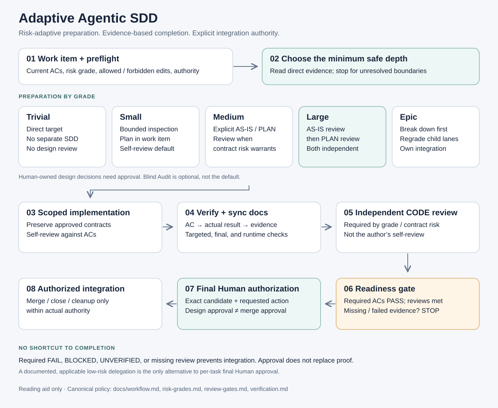
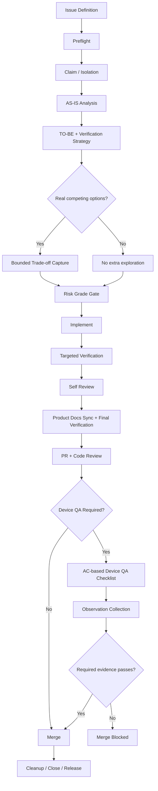

# Adaptive Agentic SDD

**Issue-first · Risk-Gated · Verification Strategy · Device QA · Bounded Exploration**

[](assets/workflow-overview-en.svg)

**[Open the detailed workflow diagram →](assets/workflow-detailed-en.svg)**

Adaptive Agentic SDD is a working methodology for using AI coding agents with enough structure to prevent expensive mistakes without forcing heavyweight process on every change.

It combines ideas from specification-driven development, legacy-system AS-IS analysis, risk-based quality gates, test/verification planning, architecture governance, and agent orchestration.

> The goal is not to maximize process.  
> The goal is to apply the **minimum process that reliably prevents costly mistakes**.

## Why this exists

AI coding agents can move quickly, but speed creates a few recurring failure modes:

- implementing the wrong interpretation of a requirement,
- changing files outside the intended scope,
- treating stale documentation as current behavior,
- exploring too much of the repository and wasting context/tokens,
- passing tests while missing device/runtime behavior,
- performing review only after a risky design is already implemented,
- leaving temporary planning artifacts behind after the product behavior has changed.

Adaptive Agentic SDD addresses these by making the work **issue-driven, risk-adaptive, evidence-gated, and bounded in exploration**.

## Core principles

1. **Issue-first**  
   The current issue is the execution specification for goal, scope, boundaries, dependencies, and acceptance criteria.

2. **Observed AS-IS**  
   Current behavior is determined from the current mainline code, not from old design documents.

3. **Information-specific Source of Truth**  
   There is no universal single authority for every kind of information. Requirement, current behavior, architecture, UI, and product rules can have different authoritative sources.

4. **Risk-adaptive depth**  
   Process depth scales with change risk.

   | Grade | Default depth |
   | --- | --- |
   | Small | Lean |
   | Medium | Standard |
   | Large | Deep + design review |
   | Epic | Breakdown + deep design/review |

5. **Verification Strategy before implementation**  
   Each important acceptance criterion should have a known way to prove it.

6. **Trade-off Capture, not Trade-off Discovery**  
   Do not brainstorm alternatives just to fill a document. Capture trade-offs only when real competing options already appear during bounded analysis.

7. **Bounded exploration**  
   Start from the issue, direct paths, symbols, public contracts, callers/callees, and only expand when concrete evidence requires it.

8. **Evidence-based completion**  
   Tests, CI, review, and device QA are evidence. Unrun verification is not a pass.

9. **Lifecycle completion**  
   The work is not finished until final behavior is verified, durable product documentation is synchronized when needed, temporary SDD artifacts are removed, and the work lane is released.

## Workflow

The overview above is intentionally compact for quick scanning. The detailed diagram expands the same lifecycle with Source of Truth, Trade-off Capture, review gates, Device QA triggers, and token-efficiency rules.

**[Open detailed workflow →](assets/workflow-detailed-en.svg)**



## Risk grades

### Small — Lean
Use when the change stays within one implementation boundary and has no high-risk characteristics.

- no separate SDD package required,
- issue body can serve as the change plan,
- targeted verification,
- self-review.

### Medium — Standard
Use when multiple implementation boundaries or shared contracts are involved but the change is not high-risk.

- AS-IS / TO-BE / change plan,
- verification strategy,
- bounded review when useful,
- no mandatory repository-wide rediscovery.

### Large — Deep
Use for high-impact changes such as security/privacy, schema migration, retry/scheduling policy, cost/quota enforcement, or similarly expensive failure modes.

- AS-IS gate,
- TO-BE/change-plan gate,
- design review before implementation,
- independent code review before merge,
- broader verification.

### Epic — Breakdown first
Use when the work changes module boundaries, creates modules, or contains multiple independently deliverable capabilities.

- break down first,
- define integration ownership,
- then apply Large-level rigor to the relevant implementation lanes.

## Token / context efficiency

Adaptive Agentic SDD deliberately avoids the assumption that “more context is always better.”

Default rules:

- do not read unrelated issues or domains,
- start from direct path/symbol,
- reuse unchanged context within the same run,
- do not re-discover requirements already fixed by the issue,
- run targeted checks before broad checks,
- do not ask review/QA agents to redesign the product,
- do not perform repository-wide alternative discovery for trade-off documentation.

The intended reasoning budget is adaptive:

```text
Small  -> Lean
Medium -> Standard
Large  -> Deep
Epic   -> Breakdown + Deep + Independent Review
```

## Repository structure

```text
adaptive-agentic-sdd/
├─ README.md
├─ assets/
│  ├─ workflow-overview-en.svg
│  └─ workflow-detailed-en.svg
├─ docs/
│  ├─ concepts.md
│  ├─ workflow.md
│  ├─ source-of-truth.md
│  ├─ risk-grades.md
│  ├─ verification.md
│  ├─ review-gates.md
│  ├─ device-qa.md
│  ├─ token-efficiency.md
│  └─ trade-off-capture.md
├─ templates/
│  ├─ issue.md
│  ├─ as-is.md
│  ├─ to-be.md
│  ├─ change-plan.md
│  ├─ pull-request.md
│  └─ device-qa.md
└─ examples/
   ├─ small/
   ├─ medium/
   └─ large/
```

## Status

**v0.1 — Working Methodology**

This is intentionally presented as a practical workflow, not a universal standard. A key part of operating it is removing gates that do not prevent real failures.

A healthy workflow should become **smaller and sharper** over time, not endlessly accumulate rules.
