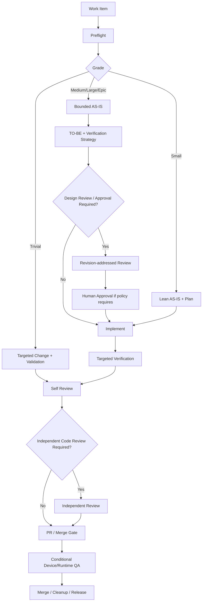

# Adaptive Agentic SDD

**Work-item-first · Risk-Gated · Progressive Disclosure · Revision-Bound Approval · Evidence-Based Completion**

Adaptive Agentic SDD is a practical workflow for using AI coding agents with enough structure to prevent expensive mistakes without forcing heavyweight process on every change.

The methodology combines specification-driven development, observed legacy-system analysis, risk-based quality gates, verification planning, bounded agent exploration, review provenance, and lifecycle completion.

> The goal is not to maximize process.  
> The goal is to apply the **minimum process that reliably prevents costly mistakes**.

## What changed in v0.2

v0.2 keeps the original methodology but adds a portable agent-runtime layer learned from repeated real repository use:

- a **Trivial** fast-track for non-behavioral changes,
- **progressive disclosure**: small root instructions route agents to task Skills, which conditionally load deeper policy,
- explicit separation between **portable workflow rules** and **project-local safeguards**,
- phase-aware review packets instead of broad repository rediscovery,
- review findings separated into decision, execution-contract, implementation, and non-blocking classes,
- **revision-bound Human approval**: review PASS is not approval, and approval is tied to a phase, artifact revision, and decision scope,
- a bootstrap path for adopting the workflow in an existing repository without importing every gate at once,
- starter `AGENTS.md` and implementation Skill examples under `starter/`.

## Core principles

1. **Work-item-first**  
   The current work item (GitHub Issue, Jira ticket, or equivalent) is the execution specification for goal, scope, boundaries, dependencies, and acceptance criteria.

2. **Observed AS-IS**  
   Current behavior is determined from current mainline code and runtime evidence, not from stale design prose.

3. **Information-specific Source of Truth**  
   Requirement, current behavior, architecture, UI, and product rules can have different authoritative sources.

4. **Risk-adaptive depth**  
   Process depth scales with change risk, not ticket size alone.

   | Grade | Default depth |
   | --- | --- |
   | Trivial | Fast-track |
   | Small | Lean |
   | Medium | Standard |
   | Large | Deep + independent design review |
   | Epic | Breakdown + deep review of risky lanes |

5. **Progressive disclosure**  
   Agents should read the smallest stable entry contract first, then load task-specific Skill/process documents only when the current task requires them.

6. **Verification Strategy before implementation**  
   Important acceptance criteria should have a known way to prove them before code is changed.

7. **Bounded exploration**  
   Start from the work item, direct paths/symbols, public contracts, and direct callers/callees. Expand only when evidence requires it.

8. **Review is falsification, not redesign**  
   Reviewers should primarily look for concrete ways the proposed change can be wrong, unsafe, inconsistent, or unverifiable.

9. **Revision-bound Human approval**  
   When Human approval is required, bind it to the exact phase, artifact revision, and decision scope presented to the Human. A materially changed artifact requires fresh review/approval.

10. **Evidence-based lifecycle completion**  
    Unrun checks are not PASS. Work is complete only when required verification, review, durable documentation sync, merge/cleanup, and lane release are actually complete.

## Workflow



See [docs/workflow.md](docs/workflow.md) for the canonical lifecycle.

## Portable runtime architecture

A mature repository does not need every workflow rule in `AGENTS.md`.

```text
AGENTS.md
   -> task routing + always-on hard guards
        -> task Skill
             -> conditional process/domain documents
```

This keeps initial context small while preserving hard entry paths to the rules that matter.

The `starter/` directory contains a deliberately small example that can be adapted to an existing repository. It is not a universal drop-in configuration: replace placeholders, remove irrelevant guards, and add project-local rules only after the repository actually demonstrates the need.

## Adoption path

For an existing project, start with [docs/bootstrap.md](docs/bootstrap.md):

1. observe the repository before changing workflow,
2. establish a lean root agent contract,
3. add one implementation Skill,
4. define risk grades and verification expectations,
5. pilot on Trivial/Small work,
6. add deeper review/approval gates only where failure cost justifies them.

## Repository structure

```text
adaptive-agentic-sdd/
├─ README.md
├─ docs/
│  ├─ bootstrap.md
│  ├─ concepts.md
│  ├─ workflow.md
│  ├─ source-of-truth.md
│  ├─ risk-grades.md
│  ├─ verification.md
│  ├─ review-gates.md
│  ├─ device-qa.md
│  ├─ token-efficiency.md
│  └─ trade-off-capture.md
├─ starter/
│  ├─ AGENTS.md
│  ├─ .agents/skills/implementing-issue/SKILL.md
│  └─ docs/sdd-workflow.md
├─ templates/
└─ examples/
```

## Portable core vs project-local policy

Keep these generally portable:

- work-item-first execution,
- risk grading,
- bounded exploration,
- progressive disclosure,
- verification mapping,
- revision-aware review/approval,
- evidence-based completion.

Keep these local unless they generalize across projects:

- module names and forbidden paths,
- build-tool quirks,
- device/emulator setup,
- shell/encoding workarounds,
- product vocabulary,
- provider-specific secrets/media rules,
- model/provider qualification matrices.

## Status

**v0.2 — Portable Working Methodology**

This is a practical workflow, not a universal standard. A healthy workflow should become **smaller and sharper** over time, not endlessly accumulate rules.
